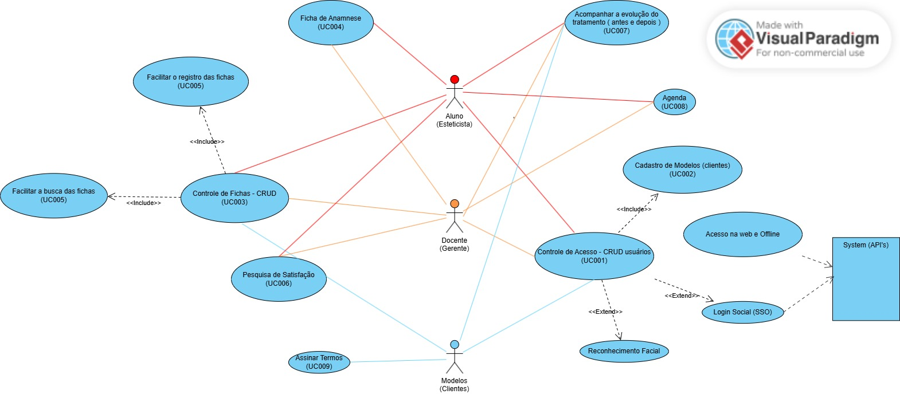

#  🎯 Projeto Estética T99

## 📄 Informações Gerais

**Projeto:** Sistema de Controle para Esteticistas  
**Versão:** 1.0.0  
**Data de Início:** 22/07/2025  
**Date de Término (prevista):** 22/08/25

## 📌 Objetivo do Projeto

Criar um sistema web/mobile de agendamento e controle de clientes e processo para a área de estética.

## Diagramas de UML

### Diagrama de Casos de Uso ( Use Case )

## 📃 Levantamento de Requisitos

|UC # | Descrição | Status | Prioridade | Dificuldade |
|-----|-----------|--------|------------|-------------|
| RF001 | Controlar Acesso (3) | - | 1 | Complexo - 5ptos |
| RF002 | Manter Modelos - CRUD (3) | - | 1 | Médio  - 3ptos |
| RF003 | Manter fichas - CRUD (3) | - | 2 | Complexo  - 5ptos |
| RF004 | Manter fichas anmnese (3) | - | 1 | Médio  - 3ptos |
| RNF005 | Facilitar registro e buscas das fichas | - | - | - |
| RF006 | Pesquisa de Satisfação do CLiente | - | 3 | Médio  - 3ptos |
| RF007 | Acompanhar tratamento (3) | - | 4 | Médio  - 3ptos |
| RF008 | Agendar tratamentos (3) | - | 3 | Complexo  - 5ptos | 
| RF009 | Assinar aceite de procedimento (1) | - | 4 | Fácil - 1pto |
| | | | Total | 30 pontos |
| | | | Total Horas | 30ptos * 4h = 120h |
| | | | Total Horas | 120h * 40,00 = R$ 5.025,00 |

**Obs:** Usar de 1 a 2 horas por ponto ( 2h pleno | Jr 4h ).  
Valor da sua hora: Jr R$ 25,00 | Pleno R$ 50,00 | Sênior R$ 80,00

Média de Mercado: Salário do Jr R$ 3500,00 / 120h = R$ 30,00/hora

Adicionando a Margem de Lucro = 30,00/hora * 1,3 = 40,00/hora

Adicionar se for o caso os Impostos = 40,00 * 1,15

## ✅ Tarefas 

| A Fazer    | Fazendo              | Feito                  |
|------------|----------------------|------------------------|
| [ ] Montar o front end CTA (Call To Action - Chamada à ação) |  |  |
|            | [ ] Montar Wireframe |                        |
|            |                      |[✅] Montar orçamento  | 
|            |                      |[✅] Montar contrato   |

## Landing Page com captação de Leads - R$ 1200,00 à R$ 3500,00

São campos onde os clientes se cadastram para receber descontos, novidades, etc.

## Definir a tecnologia do Sistema
- Sistema Web R$ 8.000,00 | App Android / iOs R$ 45.000,00
- HTML + CSS e JS - frameworks REACT.js | Bulma | Bootstrap
- PHP + mysql - 10,00/mês | Python com Flask + R$ 60,00
- mysql | PostgreSQL | Oracle | DBII

## Comandos Docker Compose

| Descrição | Comando |
|------|-----|
| Criar e Iniciar os containers | `docker compose up -d --build` |
| Parar containers | `docker stop numeroContainer`|
| Remover o container | `docker rm numeroContainer`|
| Ver os containers rodando/Desligados | `docker ps -a` |
| Acessando o terminal do container | `docker compose run nome/ID bash` |
| Instala pacotes no Debian/Ubuntu | `apt install nome` |
| Instala pacotes no Alpine | `apk add nome` |
| **Comandos do Composer** |  |
| Executando o composer | `docker compose exec web composer --version` |
| Criando o projeto Laravel | `docker compose exec web composer create-project laravel/laravel .`  |
| Descobrir seu ID | `echo $UID` ou `id -u` |

## Algoritmo - coleta de e-mails (leads)

- Preenche o campo e-mail(obrigatório)
- Confirmar a aceitação dos termos (obrigatório)
- Envia os dados para o PHP
- PHP cadastra no DB

